<div align="center">

# K-Arch Trip
### 텀블러 형태로 검증하는 건축 양식 판별 파이프라인

사진 한 장으로 완성하는 나만의 K-건축 도감

현대오토에버 모빌리티 SW 스쿨 4기 스마트팩토리 머신비전 5조 (2026.09)

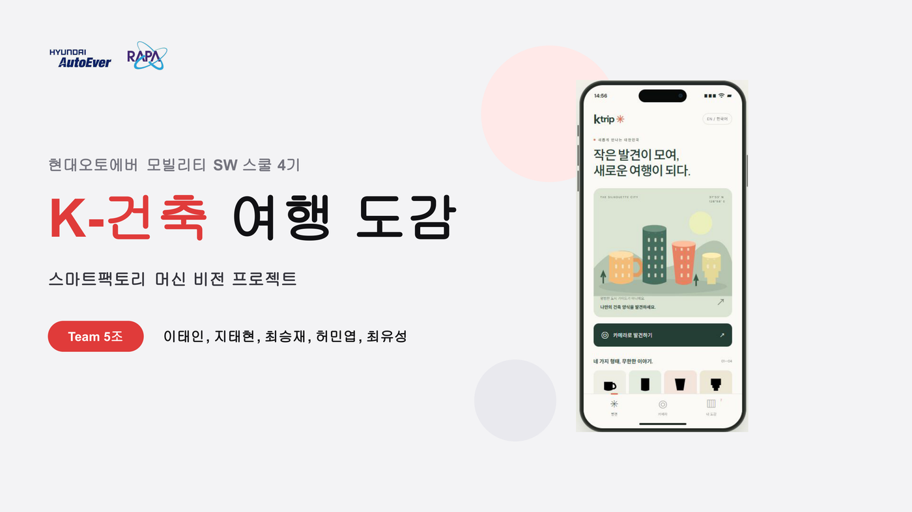

[📄 최종 발표 자료](ppt/K건축여행도감_최종발표.pdf) · 🎥 데모 영상은 `ppt/` 폴더에 로컬 보관(용량 문제로 저장소 미포함)

</div>

## 프로젝트 요약

- 사진을 올리면 텀블러 형태(머그형 / 직선 원통형 / 연속 테이퍼형 / 단차 테이퍼형) 4종을 자동 분류
- **같은 실루엣 판정 규칙이 건축물 파사드에도 적용된다**는 전제로, 건축물 데이터 없이도 판별 시스템을 먼저 구축·검증
- 룰베이스부터 Vision Transformer까지 **6갈래 방법론을 같은 데이터·같은 평가 기준으로 공정 비교**
- 실행 방법: [docs/getting-started.md](docs/getting-started.md)

| 항목 | 결과 |
|---|---|
| 데이터셋 | 642장 학습/검증(크롤링) + 126장 평가(직접 촬영), 4클래스 |
| 최고 성능 | EfficientNet-B0 — 실촬영 정확도 88.1%, Macro-F1 0.879 |
| Domain shift 검증 | 6개 트랙 모두 Val→실촬영 하락폭을 정량 비교 |
| 라이브 데모 | 2종 (Streamlit 웹 앱, FastAPI 모바일 웹 앱) |
| 자동화 테스트 | pytest 10개 (룰베이스 합성 마스크 검증) |

## 목차

1. [프로젝트 배경](#1-프로젝트-배경)
2. [분류 체계](#2-분류-체계)
3. [데이터 수집](#3-데이터-수집)
4. [데이터 전처리](#4-데이터-전처리)
5. [모델 — 6갈래 비교](#5-모델--6갈래-비교)
6. [실험 결과 및 분석](#6-실험-결과-및-분석)
7. [한계 및 보완 방향](#7-한계-및-보완-방향)
8. [라이브 데모](#8-라이브-데모)
9. [기술 스택](#9-기술-스택)
10. [팀 구성](#10-팀-구성)
11. [회고](#11-회고)
12. [관련 문서](#12-관련-문서)

## 1. 프로젝트 배경

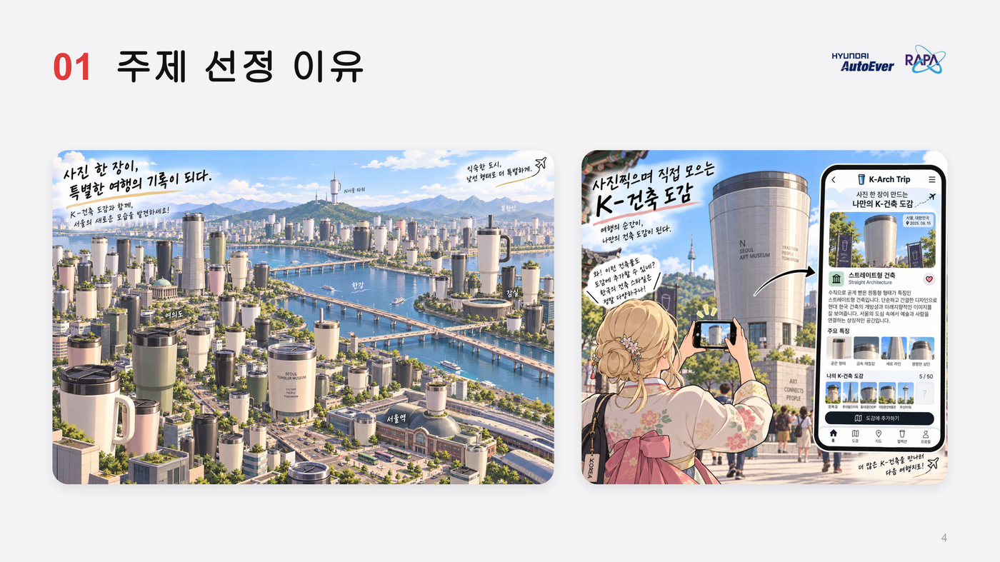

- **최종 목표는 건축 양식 판별**이지만, 라벨링된 건축물 데이터를 직접 수집하기는 현실적으로 어려움
- 대신 **같은 판정 구조를 가진 대리 도메인(proxy domain)인 텀블러 형태**로 치환해 파이프라인을 먼저 구현·검증
- **검증 대상은 모델이 아니라 시스템** — 개별 모델 정확도보다 "어떤 방법론이 왜 잘 되고 왜 안 되는지"를 공정한 구조로 비교하는 것이 핵심

| 항목 | 건축양식 (목표 도메인) | 텀블러 (대리 도메인) |
|---|---|---|
| 판정 유형 | 식별·폐쇄집합 분류 | 동일 |
| 판별 단서 | 정면 파사드의 윤곽 + 부분 요소 | 정면 몸통의 윤곽 + 기울기·단차 |
| 촬영 변이 | 각도·거리·조명·가림 | 동일 |
| 데이터 수집 | 직접 수집 어려움 | 수집 가능 |

두 도메인 모두 **"정면이 보여야 판정된다"**는 공통 성질을 가지며, 실제로 **촬영 각도(원근 왜곡)** 가 이 프로젝트에서 가장 큰 domain-shift 실패 원인으로 확인됐다 — 건축물 파사드 인식에서도 그대로 재현될 제약이다.

## 2. 분류 체계

형태 4종 — 몸통 실루엣 하나의 축으로 전부 갈리며, 판정 규칙은 문장·숫자로 고정한다.

| 종류 | 판정 규칙 |
|---|---|
| 머그형 (`mug`) | 높이가 지름의 1.5배 이하 — **손잡이 유무는 보지 않는다** |
| 직선 원통형 (`straight`) | 아래 지름이 위 지름의 95% 이상, 윤곽이 거의 수직 |
| 연속 테이퍼형 (`taper_smooth`) | 아래로 좁아지되 꺾임점 없이 매끄럽게 좁아짐 |
| 단차 테이퍼형 (`taper_step`) | 윤곽에 뚜렷한 꺾임이 1회 이상, 그 지점에서 지름이 줄어듦 |

**우선순위 규칙**: 실루엣이 손잡이보다 우선한다 — 손잡이 달린 테이퍼 텀블러는 머그형이 아니라 연속 테이퍼형. 재질·용량·브랜드는 카메라로 판별하기 어렵거나 형태와 무관해 분류 축에서 제외.

## 3. 데이터 수집

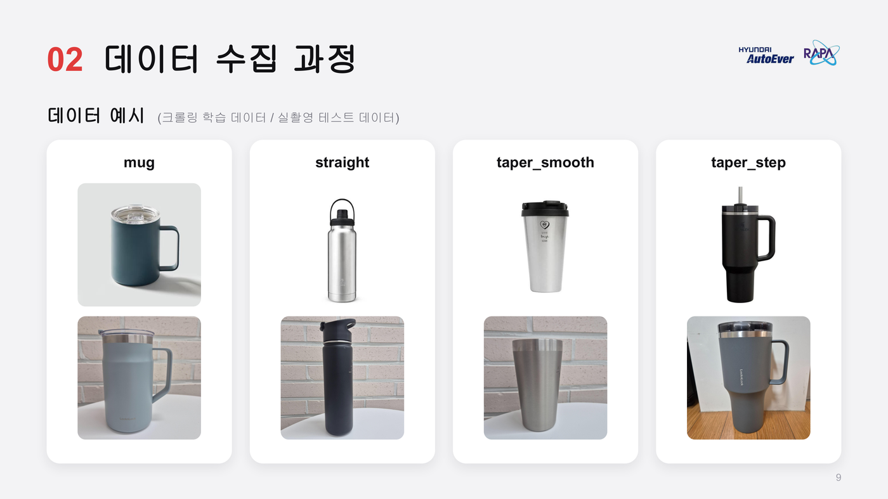

| 구분 | 수량 | 출처 |
|---|---|---|
| 학습(train) | 515장 | 크롤링(네이버 쇼핑 API 1순위, 부족분은 검색 크롤링) |
| 검증(val, "Test1") | 127장 | 크롤링 — 학습과 같은 도메인의 홀드아웃 |
| 평가(test, "Test2") | 126장 | **직접 촬영** — 학습에 전혀 쓰이지 않은 실사용 사진 |

- **의도된 domain shift 평가**: train/val은 웹 이미지, test는 직접 촬영한 실사진. 정확도가 떨어지는 게 정상이며, **그 하락폭 자체가 비교 지표**다.
- 각 팀원이 네이버 쇼핑·SSG몰·구글·쿠팡·G마켓 등 서로 다른 출처에서 4개 클래스를 모두 수집해 출처 편향을 줄임(크롤링 700장 확보)
- 수집 출처 우선순위: ① 네이버 쇼핑 API(공식 카테고리가 라벨 역할) → ② 검색 크롤링(부족분만) → ③ 직접 촬영(Test 전량)

자세한 내용은 [docs/dataset-composition.md](docs/dataset-composition.md), [docs/data-collection-plan.md](docs/data-collection-plan.md) 참고.

## 4. 데이터 전처리

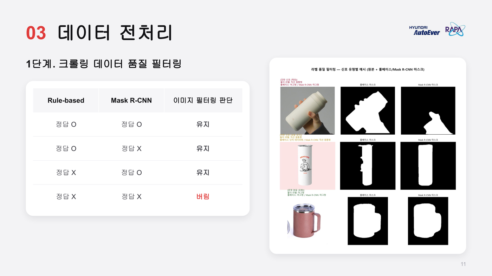

1. **크롤링 데이터 품질 필터링** — 룰베이스와 Mask R-CNN이 **둘 다** 폴더 라벨과 다르게 판정한 이미지만 버림(교차검증으로 "강한 신호"만 걸러내 과도한 필터링 방지) → 700장 → 642장
2. **이미지 방향 메타데이터 정규화** — 직접 촬영 158장 중 13장의 EXIF 방향을 픽셀 자체에 반영해 세로로 통일
3. **배경-객체 색상 유사 이미지 제거** — 배경과 색이 비슷해 구분이 어려운 32장을 평가셋에서 제외 → 158장 → 126장

모든 트랙이 **동일한 stratified_split(seed=42)** 을 재사용해서, Test1(Val) 127장이 트랙 간에 완전히 동일하게 재현된다 — 공정 비교의 핵심 장치. 자세한 과정은 [docs/label-quality-filtering.md](docs/label-quality-filtering.md) 참고.

## 5. 모델 — 6갈래 비교

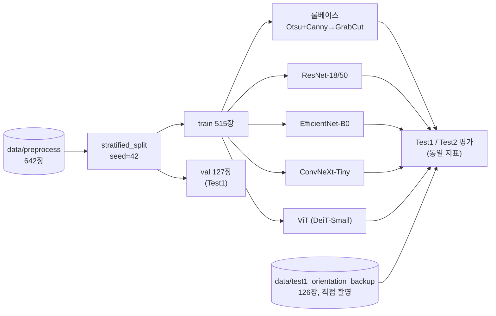

### 5-1. 룰베이스 (OpenCV)

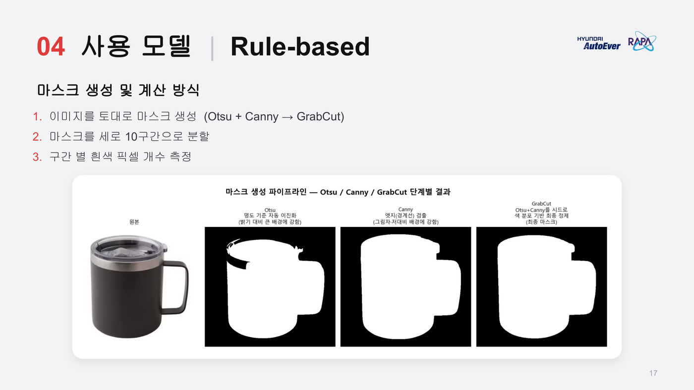

- Otsu 이진화 + Canny 엣지를 합쳐 GrabCut 시드로 사용 → 마스크를 세로 10구간으로 분할 → 구간별 폭으로 판정
- 저대비 배경, 그림자 융착 같은 세그멘테이션 실패에 구조적으로 취약 — 아래 [한계](#7-한계-및-보완-방향) 참고

### 5-2. 전이학습 CNN — ResNet-18/50, EfficientNet-B0, ConvNeXt-Tiny

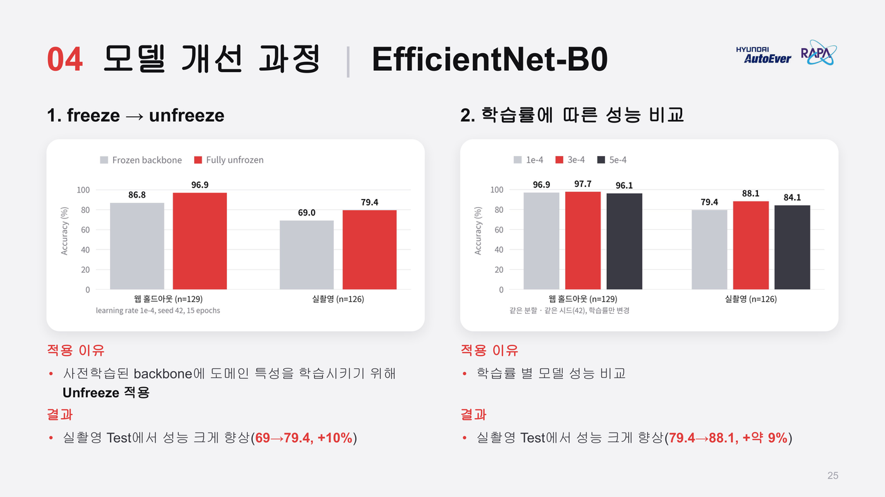

| 모델 | 핵심 기법 |
|---|---|
| ResNet-18 | 백본 unfreeze + 차등 학습률 + **Test-Time Augmentation**(스케일 3종×좌우반전, 재학습 없이 추론만 개선) |
| EfficientNet-B0 | timm, compound scaling + MBConv — freeze→unfreeze만으로 실촬영 69%→79.4%, 학습률 튜닝으로 88.1%까지 개선. 6갈래 중 실촬영 최고 성능 |
| ConvNeXt-Tiny | 2단계 학습(head warmup → LLRD finetune) + RandomPerspective/RandomErasing, val loss 기준 early stopping |

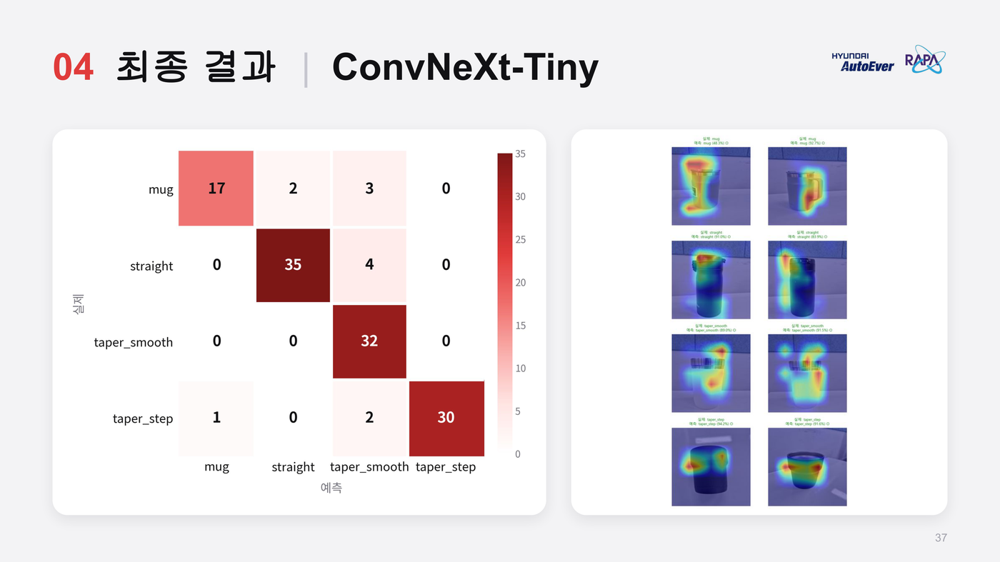

### 5-3. Vision Transformer (DeiT-Small)

- Self-attention으로 이미지 전체 영역 간 관계를 한 번에 학습 — 객체 전체 실루엣 판별에 유리할 것으로 기대
- 종횡비 보존 패딩(crop 대신 회색 여백), 마지막 4블록만 unfreeze+차등 학습률로 부분 fine-tuning
- **역설적 발견**: 이 정교한 설계가 오히려 "아무 튜닝도 안 한" 완전 베이스라인보다 실촬영 성능이 낮았음(85.7%→73.8%) — 부분 freeze가 도메인 적응을 제한한 것으로 추정, [docs/experiment-log.md](docs/experiment-log.md)에 원인 분석 기록

## 6. 실험 결과 및 분석

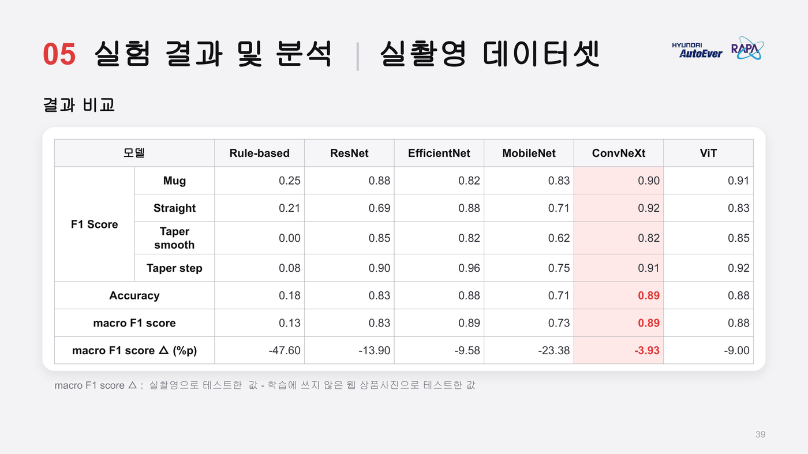

| 트랙 | Test1(Val) | Test2(실촬영) | Macro-F1(Test2) |
|---|---:|---:|---:|
| 룰베이스 | 63.0% | 18.4% | 0.135 |
| Mask R-CNN(제로샷) | - | 43.7% | 0.466 |
| ResNet-18 (+TTA) | 96.9% | 82.5% | 0.829 |
| **EfficientNet-B0** | 96.9% | **88.1%** | **0.879** |
| ConvNeXt-Tiny | 98.4% | 86.5% | 0.867 |
| ViT (완전 베이스라인) | 98.4% | 85.7% | 0.856 |

> **핵심 발견**: 가장 큰 domain shift 원인은 **촬영 각도(원근 왜곡)** — 기하학적 규칙에 의존하는 트랙(룰베이스, Mask R-CNN)일수록 크게 무너지고, **학습된 시각 패턴**을 쓰는 CNN/ViT 계열이 훨씬 강건했다. Grad-CAM으로 확인해도 배경이 아니라 물체 본체·손잡이에 정확히 집중하고 있었다.

<table>
<tr>
<td width="50%">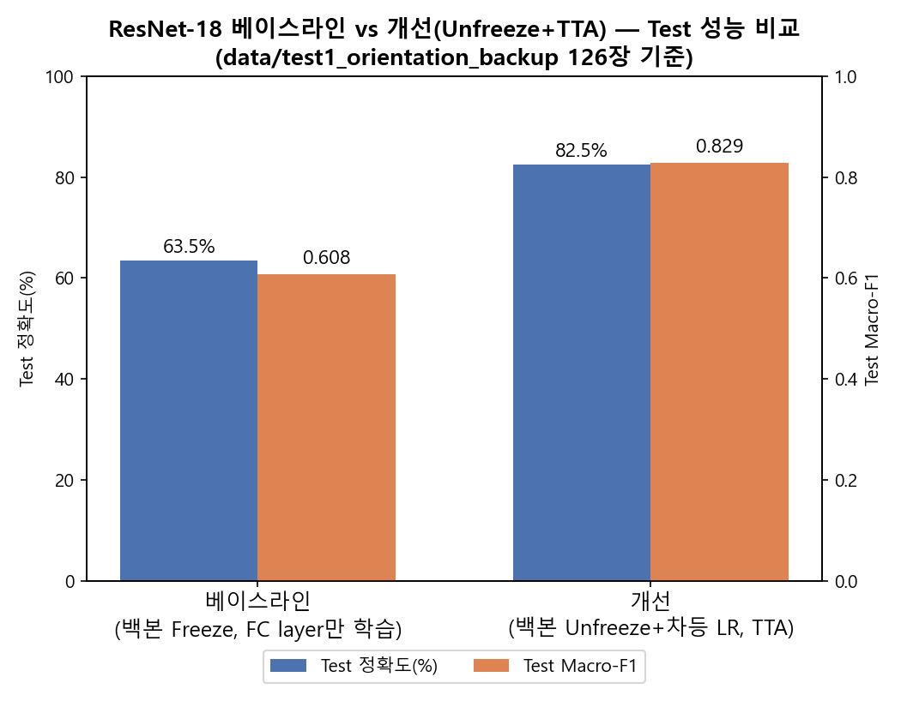</td>
<td width="50%">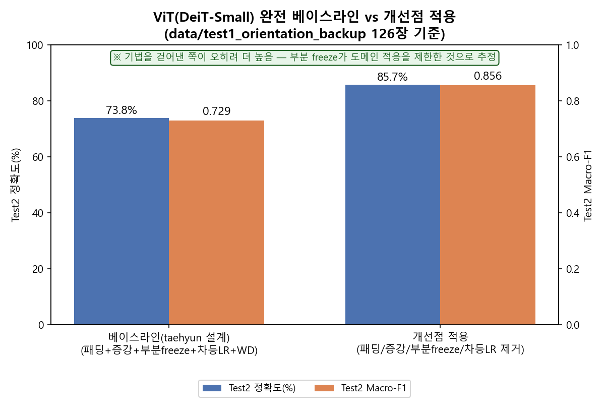</td>
</tr>
</table>

전체 실험 과정(시행착오 포함)과 트랙별 상세 수치는 [docs/experiment-log.md](docs/experiment-log.md)에 누적 기록돼 있다.

## 7. 한계 및 보완 방향

<table>
<tr>
<td width="50%">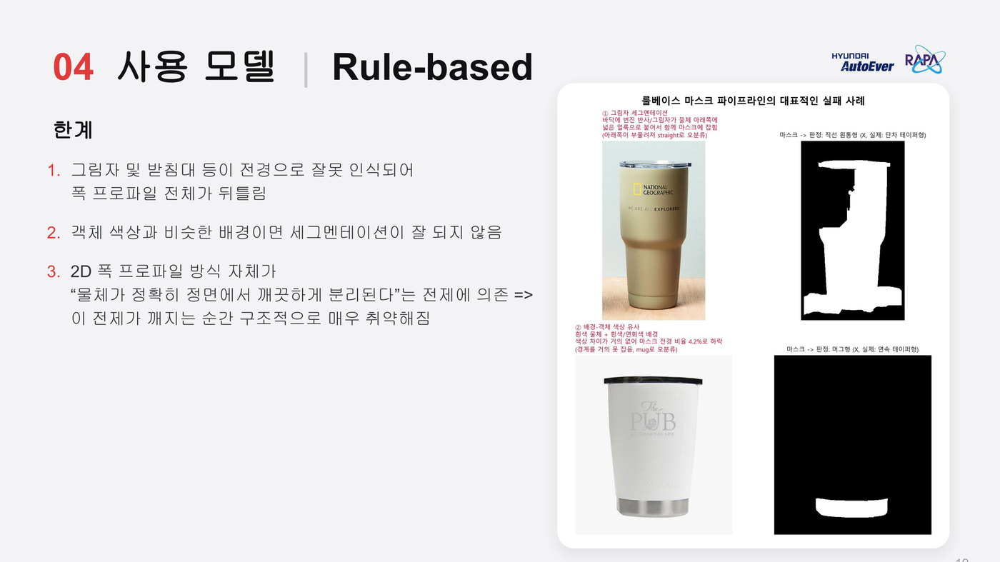</td>
<td width="50%">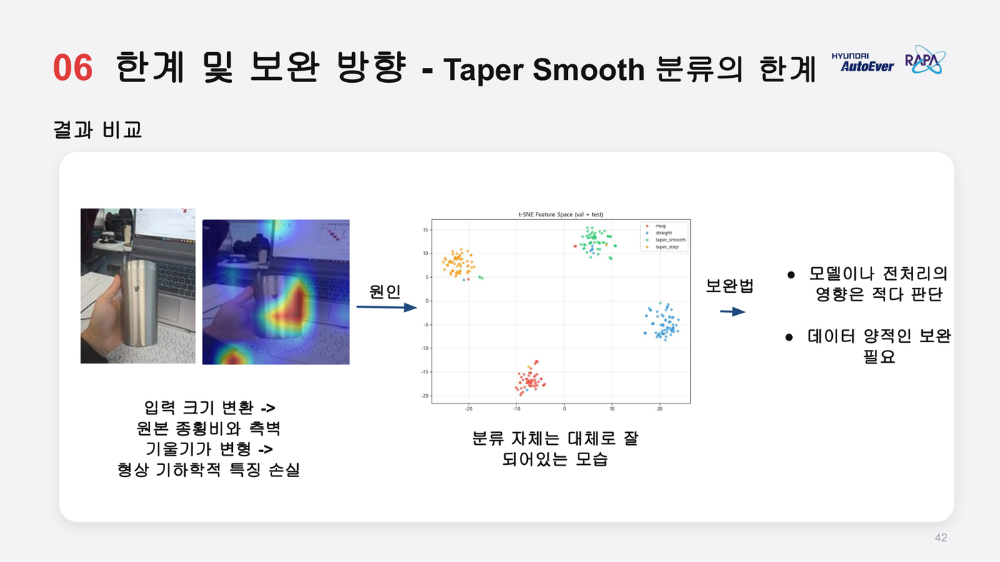</td>
</tr>
</table>

- **배경-객체 색상 유사** — 학습 데이터가 배경 없는 깨끗한 이미지 위주라, 배경과 객체 색이 비슷하면 세그멘테이션 성능이 떨어짐 → 배경 있는 데이터 추가 학습, 탐지 성능을 고려한 모델 튜닝 필요
- **Taper Smooth 분류** — 입력 크기 변환(Resize+CenterCrop) 과정에서 원본 종횡비와 측벽 기울기가 손실돼 기하학적 특징이 희미해짐 → 데이터 양적 보완 및 종횡비 보존 전처리 확대가 유효할 것으로 판단(모델/전처리 영향은 제한적으로 분석됨)

## 8. 라이브 데모


### K-Arch Trip (Streamlit) — 사진/실시간 카메라 판정 + 도감 수집

```bash
streamlit run app/demo.py
```

사진 업로드 또는 PC 카메라로 실시간 판정, 판정 근거 히트맵(Grad-CAM), 형태별 해설, 확정된 판정을 모으는 "도감" 기능을 제공한다. 모델은 `checkpoints/model/meta.json` 하나로 교체 가능(코드 수정 불필요).

### K-Trip 모바일 웹 데모 (FastAPI) — 휴대폰에서 바로 체험

```bash
cd k_trip_ios && python -m uvicorn server:app
# 또는 share.bat 실행 → Cloudflare 터널로 공개 링크 + QR 생성
```

아이폰 UI를 흉내 낸 모바일 웹 앱(네이티브 Swift 아님). 발표 당일 QR 코드로 체험자들이 직접 촬영해 도감을 채우는 라이브 데모로 사용했다.

설치부터 학습·평가·데모 실행까지 전체 절차는 [docs/getting-started.md](docs/getting-started.md) 참고.

## 9. 기술 스택

| 구분 | 기술 |
|---|---|
| 모델 | PyTorch, torchvision, timm(DeiT) |
| 고전 영상처리 | OpenCV(Otsu 이진화, Canny, GrabCut) |
| 설명가능성 | Grad-CAM(CNN 합성곱 블록 / ViT patch-token 기반) |
| 웹 데모 | Streamlit + streamlit-webrtc, FastAPI + WebSocket |
| 시각화 | matplotlib(학습곡선/confusion matrix/비교 그래프) |
| 테스트 | pytest |

## 10. 팀 구성

| 이름 | 담당 트랙 |
|---|---|
| 이태인 | ConvNeXt-Tiny 모델링, 데이터 수집 |
| 지태현 | Vision Transformer(DeiT-Small) 모델링, 데이터 수집(네이버·SSG 크롤러), ViT Grad-CAM |
| 최승재 | EfficientNet-B0 모델링, K-Trip 모바일 웹 데모(FastAPI) |
| 허민엽 | 룰베이스, ResNet-18/50, 6갈래 트랙 통합·이식, 테스트/문서화 |
| 최유성 | MobileNetV3-Small 모델링 |

## 11. 회고

- **잘한 점**
  - 룰베이스부터 ViT까지 6갈래 방법론을 같은 데이터 분할·같은 Test1/Test2 평가 기준으로 공정 비교하는 구조를 만듦
  - 발표 자료의 서술("val loss 기준 early stopping")과 실제 노트북 코드가 다르다는 걸 발견하고, 베끼지 않고 발표에서 설명한 방식을 직접 재구현해 검증
  - 팀원별로 흩어져 있던 브랜치(노트북+체크포인트+원본 데이터가 뒤섞인 상태 포함)를 트랙별 `.py` 스크립트 구조로 정리·통합
- **아쉬운 점**
  - 룰베이스의 2D 폭 프로파일 방식은 촬영 각도 왜곡에 근본적으로 취약해, 전제(정면 촬영) 자체가 깨지면 구조적 한계가 드러남
- **향후 계획**
  - MobileNetV3-Small 재구현으로 6갈래 비교 완성
  - 모든 트랙의 평가셋을 하나로 통일해 완전히 공정한 리더보드 구성
  - 3D 포인트클라우드 기반 시각화(MV-DUSt3R+) 등 원래 계획했던 확장 기능 적용

## 12. 관련 문서

| 문서 | 내용 |
|---|---|
| [docs/getting-started.md](docs/getting-started.md) | 설치·데이터 배치·학습·평가·데모 실행 방법 |
| [docs/experiment-log.md](docs/experiment-log.md) | 트랙별 실험 결과·시행착오 전체 기록 |
| [docs/testing.md](docs/testing.md) | 전체 기능 재현·검증 방법(기대 수치, 알려진 함정) |
| [docs/dataset-composition.md](docs/dataset-composition.md) | 클래스별 데이터 구성 |
| [docs/data-collection-plan.md](docs/data-collection-plan.md) | 수집 전략(API/크롤링/직접 촬영 우선순위) |
| [docs/label-quality-filtering.md](docs/label-quality-filtering.md) | 라벨 품질 필터링(룰베이스+Mask R-CNN 교차검증) |
| [docs/evaluation-metrics.md](docs/evaluation-metrics.md) | 공통 평가 지표 정의 |
| [docs/troubleshooting.md](docs/troubleshooting.md) | 겪은 문제와 해결 과정 |
| [ppt/](ppt/) | 최종 발표 자료 |
